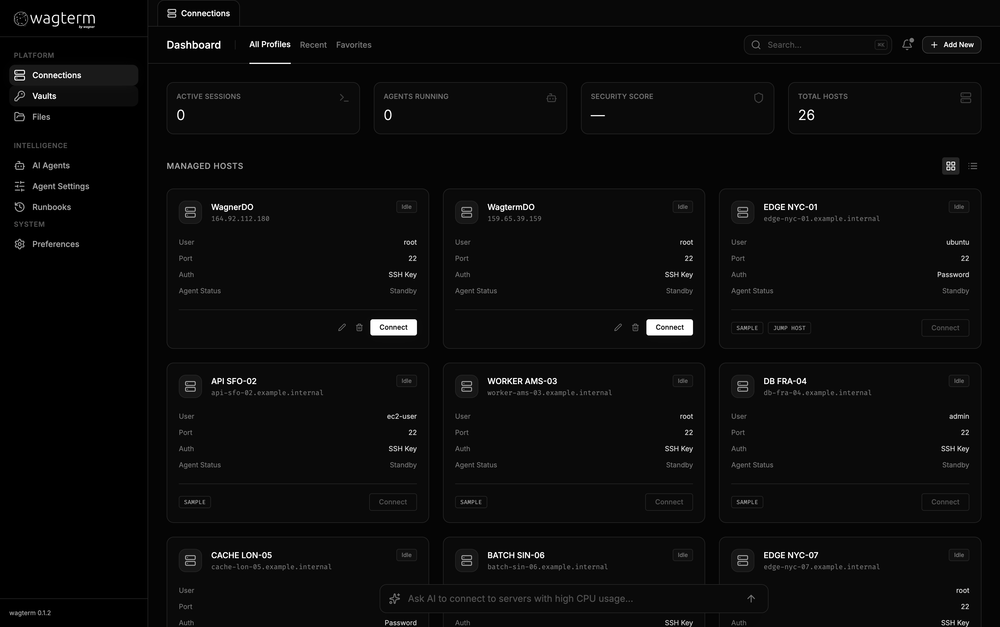

<p align="center">
  
</p>

<h1 align="center">Wagterm</h1>

<p align="center">
  <strong>AI-Powered SSH Client</strong><br>
  Manage servers smarter with intelligent command assistance.
</p>

<p align="center">
  <a href="https://github.com/WagnerAgent/wagterm/releases"></a>
  <a href="https://github.com/WagnerAgent/wagterm/actions/workflows/release.yml"></a>
  <a href="LICENSE"></a>
  <a href="https://github.com/WagnerAgent/wagterm/stargazers"></a>
</p>

<p align="center">
  <a href="https://docs.wagterm.dev">Documentation</a>
</p>

---

<p align="center">
  
</p>

---

## What is Wagterm?

Wagterm is an open-source desktop SSH client with built-in AI assistance. Connect to your servers and let AI help you execute commands, diagnose issues, and manage deployments—all with intelligent risk assessment and approval workflows.

## Key Features

- **AI-Powered Command Assistance** — Get intelligent command suggestions from GPT-5 or Claude, with automatic risk assessment (low/medium/high)
- **Multi-Provider LLM Support** — Choose between OpenAI and Anthropic models based on your preference
- **Agent Planning** — AI creates multi-step execution plans for complex tasks
- **Connection Management** — Organize SSH profiles with support for PEM keys, passwords, and jump hosts
- **Terminal Search** — Search through terminal output with keyboard navigation
- **Command History** — Track and search all executed commands per session
- **Secure Credential Storage** — Keys and secrets stored in your OS keychain
- **Auto-Approval Workflows** — Configure automatic execution for low-risk commands

## Getting Started

### Prerequisites

- Node.js 18+ (20 recommended)
- npm 9+

### Run in Dev Mode

```bash
npm install
npm run dev
```

### Build Local Installers

```bash
npm install
npm run build
npm run rebuild:electron
npm run package
```

Artifacts are placed in `release/`.

> **macOS note (unsigned builds):** If Gatekeeper blocks the app, right-click → Open once, or run:
> `xattr -dr com.apple.quarantine /Applications/Wagterm.app`

## Scripts

| Command | Description |
|---------|-------------|
| `npm run dev` | Start the app in dev mode |
| `npm run build` | Build main/preload/renderer bundles |
| `npm run preview` | Preview the renderer build |
| `npm run lint` | Run ESLint |
| `npm run rebuild:electron` | Rebuild native dependencies |
| `npm run package` | Build installers via `electron-builder` |

## Packaging

- **macOS**: `.dmg`
- **Windows**: NSIS installer

```bash
npm run build
npm run package
```

## Releases

GitHub Actions builds and publishes installers when you push a tag like `v0.1.0`. Manual runs upload artifacts only.

```bash
git tag v0.1.0
git push origin main --tags
```

## Project Structure

```
src/
├── main/       # Main process
├── preload/    # Secure IPC bridge
├── renderer/   # UI layer
└── agent/      # AI scaffolding for decisions and command proposals
```

## Roadmap

- **Blueprints** — Save and reuse command sequences as templates
- **Team Collaboration** — Share connections and workflows with your team
- **UI Enhancements** — Custom themes and styling options

## Contributing

Contributions are welcome. Please open an issue or discussion describing the change and your proposed approach.

## License

MIT. See [LICENSE](LICENSE) for details.

---

<p align="center">
  
</p>
